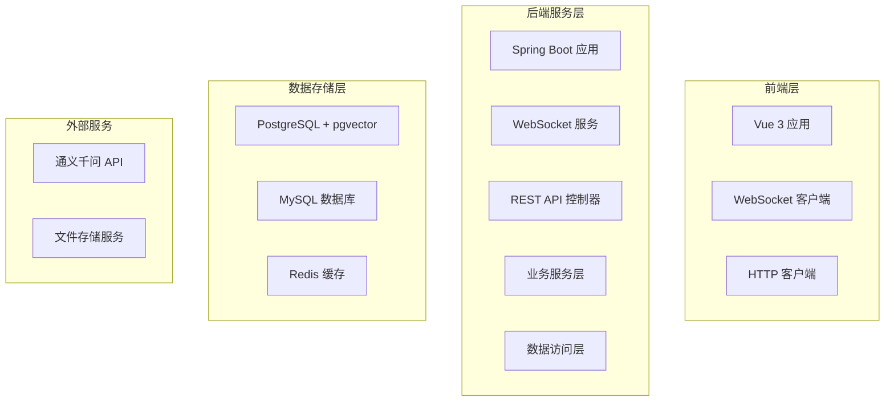

# 智能知识助手 - 技术实现文档

## 📋 文档概述

本文档详细描述了智能知识助手系统的技术实现方案，包括架构设计、技术选型、数据库设计、API接口、部署方案等技术细节。

**文档版本**：v1.0  
**最后更新**：2025年  
**目标读者**：开发团队、技术架构师、运维工程师

---

## 🏗️ 技术架构设计

### 整体架构

```
┌─────────────────────────────────────────────────────────────┐
│                        前端层 (Frontend)                      │
├─────────────────────────────────────────────────────────────┤
│  Vue 3 + TypeScript + Element Plus + WebSocket              │
│  • 聊天界面  • 文档管理  • 会话管理  • 用户设置              │
└─────────────────────────────────────────────────────────────┘
                                ↕ HTTP/WebSocket
┌─────────────────────────────────────────────────────────────┐
│                        后端层 (Backend)                       │
├─────────────────────────────────────────────────────────────┤
│  Spring Boot + Spring AI + MyBatis + WebSocket              │
│  • REST API  • WebSocket服务  • 业务逻辑  • 数据访问          │
└─────────────────────────────────────────────────────────────┘
                                ↕
┌─────────────────────────────────────────────────────────────┐
│                        数据层 (Data)                         │
├─────────────────────────────────────────────────────────────┤
│  PostgreSQL + pgvector (向量数据库)                           │
│  MySQL (业务数据库)                                           │
│  Redis (缓存层)                                              │
└─────────────────────────────────────────────────────────────┘
                                ↕
┌─────────────────────────────────────────────────────────────┐
│                        AI服务层 (AI Services)               │
├─────────────────────────────────────────────────────────────┤
│  阿里云通义千问 API                                          │
│  • 文本生成  • 向量化  • 语义理解                             │
└─────────────────────────────────────────────────────────────┘
```

### 技术架构图



---

## 🛠️ 技术选型

### 后端技术栈

| 技术组件 | 版本 | 选择理由 | 主要功能 |
|----------|------|----------|----------|
| **Spring Boot** | 3.4.5 | 成熟稳定、生态丰富 | 应用框架 |
| **Spring AI** | 1.0.0 | 官方AI集成框架 | AI服务集成 |
| **MyBatis-Plus** | 3.5.5 | 灵活的SQL控制 | 数据访问层 |
| **PostgreSQL** | 14+ | 支持向量扩展 | 向量数据库 |
| **pgvector** | 0.5+ | 向量相似度搜索 | 向量存储 |
| **MySQL** | 8.0+ | 成熟稳定 | 业务数据存储 |
| **HikariCP** | - | 高性能连接池 | 数据库连接池 |
| **Lombok** | - | 简化代码编写 | 代码生成工具 |

### 前端技术栈

| 技术组件 | 版本 | 选择理由 | 主要功能 |
|----------|------|----------|----------|
| **Vue 3** | 3.3+ | 现代化框架 | 前端框架 |
| **TypeScript** | 5.0+ | 类型安全 | 开发语言 |
| **Element Plus** | 2.4+ | 丰富的UI组件 | UI组件库 |
| **Vite** | 4.0+ | 快速构建 | 构建工具 |
| **Pinia** | 2.1+ | 状态管理 | 状态管理 |
| **Axios** | 1.6+ | HTTP客户端 | API调用 |

### AI服务选型

| 服务提供商 | 模型 | 优势 | 适用场景 |
|------------|------|------|----------|
| **阿里云通义千问** | qwen-plus-latest | 中文优秀、成本适中 | 对话生成 |
| **阿里云通义千问** | text-embedding-v3 | 高质量向量化 | 文本嵌入 |

#### AI服务配置说明

- **API接入方式**: 通过阿里云DashScope兼容OpenAI格式的API接口
- **模型选择**: 
  - 对话模型使用`qwen-plus-latest`，提供优秀的中文理解和生成能力
  - 嵌入模型使用`text-embedding-v3`，向量维度为1024维
- **兼容性**: 使用OpenAI兼容的API格式，便于后续切换其他模型

---

## 🗄️ 数据库设计

### 数据架构策略

采用**混合数据访问策略**：
- **PostgreSQL + pgvector**：存储文档向量和向量检索
- **MySQL**：存储业务数据（用户、会话、消息等）
- **Redis**：缓存热点数据和会话状态(后续添加)
---

### 多数据源架构说明

#### 数据源分离策略

1. **PostgreSQL + pgvector (向量数据库)**
   - 专门用于存储文档向量和执行向量相似度搜索
   - 由Spring AI框架直接管理和使用
   - 配置为非主数据源，通过JdbcTemplate访问

2. **MySQL (业务数据库)**
   - 存储用户信息、会话记录、消息历史等业务数据
   - 使用MyBatis Plus进行ORM映射
   - 配置为主数据源，支持事务管理

#### 配置要点

- **数据源属性绑定**: 使用`@ConfigurationProperties`注解绑定配置文件中的数据源属性
- **HikariCP连接池**: 两个数据源都使用HikariCP作为连接池，提供高性能的数据库连接管理
- **事务管理**: MySQL数据源配置了事务管理器，支持声明式事务
- **MyBatis Plus集成**: 配置了分页插件和SQL会话工厂
- **Spring AI集成**: PostgreSQL数据源通过JdbcTemplate为Spring AI提供向量存储支持
---

## 🎯 总结

本技术实现文档详细描述了智能知识助手系统的完整技术方案，包括：

### 核心技术栈
- **后端**：Spring Boot + Spring AI + MyBatis-Plus
- **前端**：Vue 3 + TypeScript + Element Plus
- **数据库**：PostgreSQL (向量) + MySQL (业务) + Redis (缓存)
- **AI服务**：阿里云通义千问API

### 关键特性
- **混合数据架构**：业务数据与向量数据分离存储
- **实时流式响应**：基于WebSocket的流式对话
- **高性能检索**：pgvector向量相似度搜索
- **完整的监控体系**：应用监控、性能监控、日志监控
- **安全保障**：数据加密、访问控制、安全审计

### 部署方案
- **容器化部署**：Docker + Docker Compose
- **生产环境**：Nginx + 系统服务
- **监控运维**：Prometheus + Grafana

### 开发规范
- **代码规范**：统一的命名和注释规范
- **Git工作流**：标准的分支管理和发布流程
- **测试策略**：单元测试、集成测试、性能测试

本文档为开发团队提供了完整的技术实施指南，确保项目的高质量交付和稳定运行。